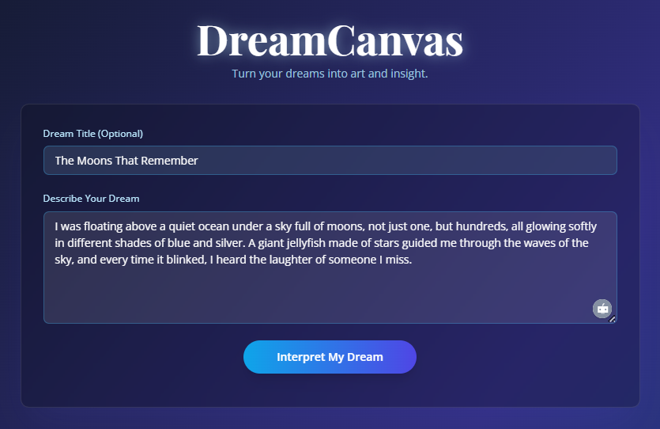
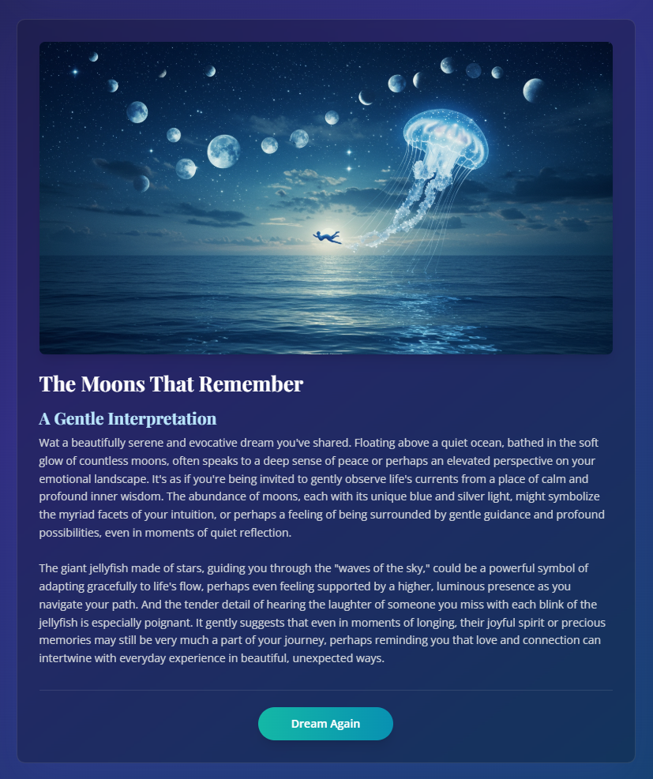

<h1 align="center">🌌 DreamCanvas – AI-Powered Dream Interpreter & Art Generator</h1>

Turn your dreams into stories and art.  
**DreamCanvas** is a serene, AI-powered web app that interprets your dreams and creates surreal, high-fantasy illustrations to match — powered by **Google Gemini** and **Imagen**.
> "Every dream has a story. Every story deserves an image." 🌙

<a href=""></a>
<a href=""></a>
<a href=""></a>

---

## ✨ Features

- 🖋 **Dream Interpretation**: Thoughtful, poetic, and emotionally intelligent readings of your dreams.
- 🎨 **AI Art Generation**: Creates mystical, dreamlike portraits inspired by your words.
- 🌊 **Soothing UI**: Minimalist, calming blue tones designed for a tranquil user experience.
- ⚡ **Instant Results**: Real-time AI text and image generation.
- 📱 **Responsive Design**: Works beautifully on desktop, tablet, and mobile.

---

## 🖼 Example

> **Dream Input:** "I was walking through a forest of glowing trees, and a silver fox guided me to a hidden lake."

**Interpretation:**  
*"The glowing trees represent inner wisdom illuminating your path. The silver fox, a rare guide, signifies intuition and protection, leading you toward self-discovery, symbolized by the hidden lake."*

**Generated Image:**  
*(AI-generated high-fantasy portrait inspired by the dream)*

---

## 🛠 Tech Stack

| Category   | Technology               |
| ---------- | ------------------------ |
| Frontend   |  |
| Styling |  |
| AI Models      | Google **Gemini** (Text) + **Imagen** (Images) |

---

## 📦 Installation & Setup

```bash
# Clone the repository
git clone https://github.com/yourusername/dreamcanvas.git
cd dreamcanvas

# Install dependencies
   `npm install`

# Add your API key
echo "VITE_API_KEY=your_gemini_api_key_here" > .env.local

# Start development server
`npm run dev`
```

---

## 👤 Author

Hadil Ben Abdallah  
🎓 Software Engineer | ✍🖋 Technical Content Creator | 📱 Social Media Content Creator  
[🌐 Portfolio](https://hadilbenabdallah.vercel.app/) | [👩🏻‍💼 LinkedIn](https://www.linkedin.com/in/hadil-ben-abdallah/) | [📝 Dev.to](https://dev.to/hadil)

---

## 🌟 Show Your Support

If you like this project:

⭐️ Star the repo  
🔁 Share it with others  
🛠️ Fork it and build your version!

<h6 align="center">Made with 💙 By Hadil Ben Abdallah</h6>
